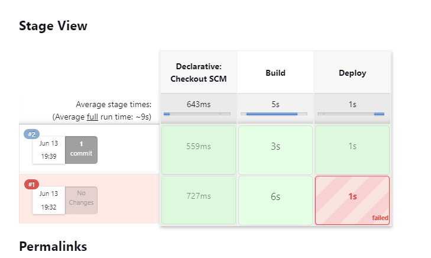

# Infrastructure Setup with Terraform, Docker, Jenkins, and EKS

This repository contains the necessary configuration files and scripts to set up infrastructure on Amazon Web Service (AWS) using Terraform, Docker, Jenkins, and deploy the application using Amazon Elastic Kubernetes Service (EKS).

## Technologies Used
- [Terraform](https://www.terraform.io/): Infrastructure as Code (IaC) tool for provisioning and managing cloud resources.
- [Docker](https://www.docker.com/): Containerization platform to package and distribute applications.
- [Jenkins](https://www.jenkins.io/): Automation server for continuous integration and deployment.
- [Amazon EKS](https://aws.amazon.com/eks/): Fully managed Kubernetes service by AWS.

## Usage

1. Clone the repository:

   ```bash
   git clone https://github.com/MohamedSaleh712/cyborg-gaming-ITI-final-project.git
   ```

2. Run the Script `script.sh`.

   ```bash
   #!/bin/bash

    cd ./terraform
    terraform init 
    terraform fmt 
    terraform validate 
    terraform apply --auto-approve

    aws eks update-kubeconfig --region us-east-1 --name eks-iti-final-project --profile terraform-user
    sleep 10
    kubectl apply -f ../jenkins-deployment/jenkins-namespace.yaml
    kubectl apply -f ../jenkins-deployment/jenkins-service-account.yaml
    kubectl apply -f ../jenkins-deployment/jenkins-pv-pvc.yaml
    kubectl apply -f ../jenkins-deployment/jenkins-service.yaml
    kubectl apply -f ../jenkins-deployment/jenkins-deploy.yaml
   ```
